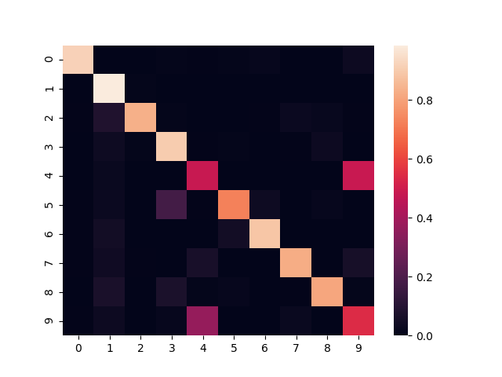

# pt-autoencoders

PyTorch implementation of AutoEncoder based models (*note these implementation are unofficial*). Compatible with PyTorch 1.0.0 and Python 3.6 or 3.7 with or without CUDA.

## Examples

An example using MNIST data can be found in the `examples/mnist/mnist.py` which achieves around 80% accuracy using
k-Means on the encoded values.

Here is an example [confusion matrix](http://scikit-learn.org/stable/modules/generated/sklearn.metrics.confusion_matrix.html), true labels on y-axis and predicted labels on the x-axis.

## Usage

This is distributed as a Python package `models` and can be installed with `python setup.py install`. The PyTorch `nn.Module` class representing the SDAE is `StackedDenoisingAutoEncoder` in `autoencoders.sdae`, while the `pretrain` and `train` functions from `autoencoders.model` are used to train the autoencoder.